Keypad-Mapper 3 user manual
###########################

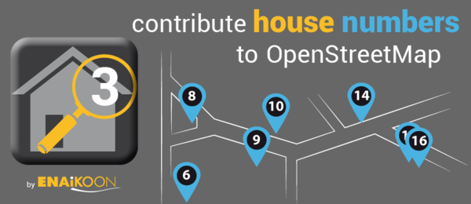

**Keypad-Mapper 3** is an Android application dedicated to the rapid mapping
of house numbers and address nodes. Photos and audio notes with recorded GPS
coordinates are also supported. The application stores all the collected data
in a folder named *Keypad-Mapper 3* in the root folder of your Android device,
so it is very easy to copy the data from your device to your computer to work
with them in editors, like JOSM_ (Java OpenStreetMap Editor).

.. _JOSM: https://josm.openstreetmap.de/

Quick start
===========

1. `Find an area <http://tools.geofabrik.de/osmi/?view=addresses>`_ where
   house numbers are missing and go there.
2. Start the application and turn on the GPS. It is only possible to save
   house numbers and address nodes when there is a reliable GPS signal and
   position information, otherwise an error message will be shown.
3. Tap on the application icon in the top left corner and then on menu item
   *keypad* or swipe to the keypad screen.
4. Go to the position where you want to record a house number or an address
   node. Ensure that the house is exactly to your right, to your left or in
   front of you. Otherwise it will be difficult later to assign the house
   number node to the correct building in the OSM editor.
5. Type the house number on the keypad.
6. Save the house number by tapping on |icon-left| |icon-front| |icon-right|.
   The GPS coordinate is saved along with the address node which is actual at
   the moment the user taps on any of the icons.

   - |icon-left| means that the house number is on your left in relation to
     your walking direction.
   - |icon-right| means that the house number is on your right in relation to
     your walking direction.
   - |icon-front| means that the house number is in front of you in relation
     to your walking direction, for example at a T-crossing.

7. To create a photo, tap on the camera icon in the menu bar. This will open
   your camera on your device to take a picture.
8. To create an audio note, tap on the speaker icon in the menu bar. This will
   open a small widget with a record and a play button. Tap on the record
   button and start speaking.
9. When you are finished mapping house numbers, just close the application.
   The collected data are stored in the *Keypad-Mapper 3* folder in your
   device.

System requirements
===================

All Android versions from 2.1 are supported. The screen layout is optimized
for all size of screens.

The latest version can be downloaded from the `releases tab
<https://github.com/meskobalazs/Keypad-Mapper-3/releases>`_.

Usage
=====

**Keypad-Mapper 3** is a powerful tool to record house numbers and other
objects, as well as to create photos and audio notes. This manual describes
the main features of the application.

.. note::

   To use the application, it is required to enable the GPS. Without active
   and accurate GPS signal it is not possible to record any house numbers or
   to take photos.

Features
========

The main menu of the application is accessible via the house icon in the top
left corner. The most important menu items are also displayed in the menu bar.

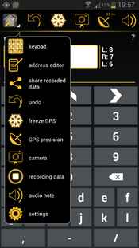

This is an overview of the menu items. If a menu item is selected, it will be
highlighted with a glow icon.

+-----------+----------------------------------------------------------------+
||app|      | This is the main application icon and opens the menu.          |
+-----------+----------------------------------------------------------------+
||keypad|   | Open the keypad for house numbers mapping.                     |
+-----------+----------------------------------------------------------------+
||address|  | Open the address editor to set the street, the postal code,    |
|           | the city and the country code.                                 |
+-----------+----------------------------------------------------------------+
||share|    | Share the recorded data via Bluetooth, email or Wi-Fi.         |
+-----------+----------------------------------------------------------------+
||undo|     | Remove the most recently added house number.                   |
+-----------+----------------------------------------------------------------+
||freeze|   | Freeze the GPS position.                                       |
+-----------+----------------------------------------------------------------+
||satellite|| Show the number of satellites and the computed precision.      |
+-----------+----------------------------------------------------------------+
||camera|   | Open the camera to take a picture.                             |
+-----------+----------------------------------------------------------------+
||record|   | Start and stop the recording of the current track.             |
+-----------+----------------------------------------------------------------+
||audio|    | Open the sound recorder to create an audio note.               |
+-----------+----------------------------------------------------------------+
||settings| | Open the settings screen to configure the application.         |
+-----------+----------------------------------------------------------------+

.. |keypad| image:: images/icon-keypad.png

Keypad
------

Keypad is the most frequently used function. With this screen can be recorded
the house numbers.

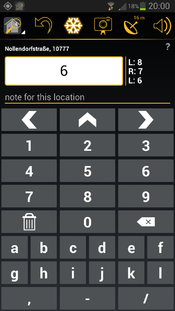

The screen layout is optimized for all size of screens. For tablets with 7" to
10" screens not only the keypad is visible, but the address editor. This user
interface is automatically activated on all devices with a minimum screen size
of 7". Keypad-Mapper 3 supports both portrait and landscape modes:

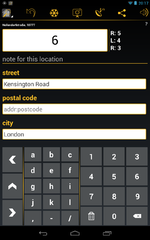
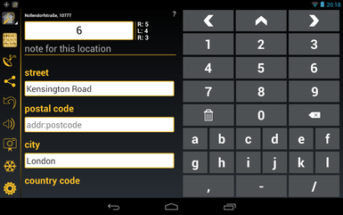

Using devices with small screen, the portrait mode contains only the letters
A, B and C. If you need more letters to the house numbers, you have to rotate
the device to landscape mode. In landscape mode the letters are displayed from
A to L.

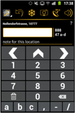
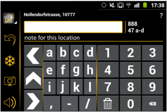

In a device with tiny screen only the numbers are displayed in both portrait
and landscape mode.

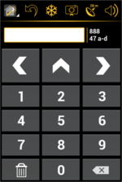
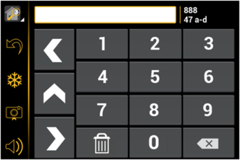

The usage of this screen is easy. Just type the house number and press one of
the |icon-left| |icon-front| |icon-right| icons to save the house number.

- |icon-left| means that the house number is on your left in relation to your
  walking direction.
- |icon-right| means that the house number is on your right in relation to
  your walking direction.
- |icon-front| means that the house number is in front of you in relation to
  your walking direction, for example at a T-crossing.

Optionally a text note can be added to the house number. The text box for the
note is located between the display of the entered house number and the save
icons (in tiny screens the text box for the note is not visible).

Tapping on the house number entry field in the keypad screen opens a full
keyboard for entering an unusual house number.

Before saving the house number, ensure that the house is exactly to your
right, to your left or in front of you. Otherwise it will be difficult later
to assign the house number node to the correct building in the OSM editor.

The position of the house number will be 10 meters from your current position
to left, to right or in front of you by default. The distance can be changed
in the settings.

When you save the house number, the device will vibrate as feedback. This is
useful, when the screen is hardly visible because of the sunshine.

The |icon-clear| can be used to completely clear the entered house number
before saving it.

The last two or three stored house numbers are continuously shown on the right
side of the house number entry field. The amount of shown house numbers
depends on the size of the screen.

The number shown in the circle of the application icon in the top left corner
indicates the number of house numbers mapped that day. This can be a
motivation for the mapper.

Address editor
--------------

An address contains not only the house number, but it has street, zip code,
etc. With this screen these additional information can be set. These are
optional. If this information is not set, then only the house number will be
stored.

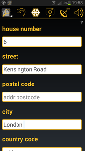

In this screen the following information can be set:

- house number 
- street
- postal code
- city
- country code
- house name

More information about these properties can be found in the OpenStreetMap Wiki
on the `address <https://wiki.openstreetmap.org/wiki/Key:addr>`_ page.

Keypad-Mapper will remember this information and add them to the recorded
address node, until the entered information is not changed. For example if
you would like to record all the house numbers in a street, you have to enter
the street, the postal code and the city only once.

Country code may not be required, because it can be calculated from the
`administrative boundary
<https://wiki.openstreetmap.org/wiki/Tag:boundary%3Dadministrative>`_ from
the OpenStreetMap (if it is used correctly).

House name may also not be required, unless the house has an exact name.

Share recorded data
-------------------

With this feature the application can send all recorded data (.osm files, .gpx
files, audio notes and photos) by email, Bluetooth or Wi-Fi directly to the PC
which runs the OSM editor.

The e-mail address entered is stored on the device for future use and can be
changed at any time.

.. note::

   Sending an email with many large photos is not a good idea. Some email
   account can not receive emails with size of many megabytes. It is
   recommended to copy the recorded data directly with an USB cable connected
   to your computer. All the recorded data can be found in the *Keypad-Mapper
   3* folder in the root of the device.

Undo
----

This option removes the most recently added house number from the .osm file.
It is **not possible** to undo more than one previously recorded house number.

Freeze GPS
----------

In some cases, the entrance with the house number is mounted at a location
separate from the actual entrance of the building. In these cases, you must
first go to where the house number is mounted, then go back to map the address
node at the proper GPS position.

There are other cases, like the situation, where the house number is hidden,
making it necessary for you to pass the entrance and then look back for
reading the house number.

With the freeze option you can freeze the actual GPS position of the entrance
(indicated by the highlighted freeze icon).

This allows you to go to the place where the house number is visible, enter
the house number, and save it with the previously saved GPS position of the
entrance.

After saving the house number by tapping on any of the |icon-left|
|icon-front| |icon-right| icons, the freeze mode is canceled automatically and
the freeze icon is no longer highlighted.

Another use case of the freeze GPS option is taking a photo with the GPS
coordinates of the subject in the photo. In this case, you can go to the place
where the subject of the photo is located, use the freeze GPS option, and then
relocate to take the picture of the subject. This ensures that the GPS
coordinates stored inside the JPEG file points to the position of the place
and not to the position of the photographer.

GPS precision
-------------

The screen gives information about the current GPS reception.

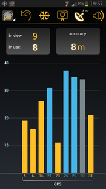

This screen gives an overview about the visible and the used GPS satellites
and the computed accuracy. Depending on the accuracy the following icons
indicate the precision in the menu bar.

+---------+------------------------------------------------------------------+
||i-s|    | If the GPS precision icon in the menu bar shows no number, then  |
|         | there might be GPS reception, but quality is not good enough for |
|         | the Keypad-Mapper 3.                                             |
+---------+------------------------------------------------------------------+
||i-s-n|  | The GPS precision icon in the menu bar shows the GPS precision   |
|         | in meters or feet depending on the measurement unit settings.    |
+---------+------------------------------------------------------------------+
||i-s-n-n|| If the compass of the device is used for calculating the         |
|         | direction, then a compass needle in the GPS icon is shown.       |
+---------+------------------------------------------------------------------+

.. |i-s-n-n| image:: images/icon-satellite-needle-number.png

Camera
------

The day-to-day experience of mapping house numbers has proven that GPS photos
are useful for remembering complicated situations or additional information
that has nothing to do with house numbers but is interesting enough to being
mapped. In many cases, such photos save the mapper from entering additional
text (for example for remembering a complete address printed on a menu, hints
for special signs, etc.). The photo is taken with GPS information stored in
the Exif meta data of the JPEG file. The photo can be uploaded along with the
.gpx and .osm files to JOSM or to any other OSM editor and will be shown on
the map where it was taken.

Tapping the camera icon will open the camera of your device to take a photo.
When the photo was taken, there is a possibility to save the image or cancel.

The photos are also stored in the *Keypad-Mappar 3* folder (and in your
gallery, too).

Recording data
--------------

This feature allows users to start/stop recording and to start recording based
on a new set of .osm and .gpx files. This is the same feature as a normal GPS
logger does: it records the current position periodically in every X second
and creates a track from the positions.

In addition a setting option *turn off GPS* has been added. The *recording
data* feature and the *turn off GPS* feature correlate as follows:

- if recording is active, a .gpx track is recorded
- if recording is active then a .gpx file is recorded even if the application
  is in the background
- if recording is off and the *turn off GPS* feature is activated, then GPS is
  switched off in order to save battery power

The tracks are also stored in the *Keypad-Mappar 3* folder.

Audio note
----------

Recording an audio note is less conspicuous to others than taking a photo,
therefore some mappers prefer to record voice memos instead of taking GPS
photos in order to avoid calling the attention of passerby.

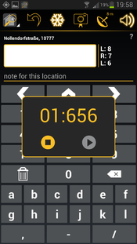

The audio note feature works similarly to the photo feature. It allows you to
record a voice memo and save it along with a GPS coordinate. Unlike .jpg
files, the GPS coordinates for audio notes are stored in the .gpx file.
Therefore the .gpx file must be loaded in JOSM before loading the .wav file.

JOSM allows you to load all mapped data including the recorded audio notes
specific to the GPS position where it was recorded. Playing the audio note
will help you remember details of that specific location.

More information about audio mapping can be found in the OpenStreetMap Wiki on
the `audio mapping <https://wiki.openstreetmap.org/wiki/Audio_mapping>`_ page.

Audio notes are also stored in the *Keypad-Mappar 3* folder.

Settings
--------

In this screen the following configuration options can be set:

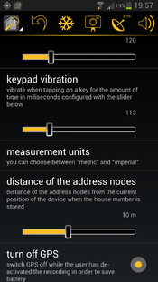

**Language**
   Choose your language: German, Spanish, French, Greek, Italian, Dutch,
   Polish, Russian, Hungarian. The default is the system language of the
   device (if translation is available for that language).

**Share recorded data**
   Share \*.gpx, \*.osm, \*.wav, and \*.jpg files. This option is the same as
   accessible via the main menu.

**Delete all collected data**
   This option deletes all collected data stored by the application on this
   device: OSM files, GPX files, and photos taken with this app. You would
   normally use this feature after successfully transmitting the data via
   email to your PC.

**Keep screen on**
   The screen will remain on when activated. Activating this option will drain
   the battery.

**Use compass**
   Up to the speed selected, compass information is used instead of GPS
   heading information for calculating the address node position.

   If the value is set to zero, then the compass information is not used. The
   speed is either specified in km/h or mph depending on the measurements
   settings. The default speed is 5 km/h.

   If the compass feature is active due to low speed, then the GPS precision
   icon indicates this with an integrated compass needle. This needle does not
   indicate the current heading.

**Vibration on save**
   Vibrate when the node is saved for the amount of time in milliseconds. The
   default value is 120 milliseconds.

**Keypad vibration**
   Vibrate when tapping on a key for the amount of time in milliseconds. The
   default value is 50 milliseconds.

**Measurement units**
   You can choose between *metric* and *imperial*.

**Distance of the address nodes**
   Distance of the address nodes from the current position of the device when
   the house number is stored. The default distance is 10 meters.

**Turn off GPS**
   Switch GPS off while the user has de-activated the recording in order to
   save battery.

**Wi-Fi data only**
   Show street name and postcode only if a Wi-Fi connection exists.

**WAV file path**
   WAV file path on your computer which will be used in tags in GPX files.

**Optimize layout**
   Enable this option will optimize the layout of the application.

References and legal notes
==========================

This manual is written based on the OpenStreetMap Wiki `Keypad-Mapper 3
<https://wiki.openstreetmap.org/wiki/Keypad-Mapper_3>`_ page.

- Author: `Balázs Úr <https://github.com/urbalazs/>`_, 2018.
- Proofreader: `Balázs Meskó <https://github.com/meskobalazs/>`_, 2018.

This manual is available under the `Creative Commons Attribution-ShareAlike
<https://creativecommons.org/licenses/by-sa/4.0/>`_ license.
